

  <b>English</b> &nbsp;·&nbsp; <a href="README_AR.md">العربية</a>

  

<h3 align="center">Movies and series, beautifully presented — played from sources you control.</h3>

  <!-- viora:version-badge -->
  
  
  

  

  <a href="#meet-viora">Overview</a> &nbsp;·&nbsp;
  <a href="#features">Features</a> &nbsp;·&nbsp;
  <a href="#vip-viora">VIP Viora</a> &nbsp;·&nbsp;
  <a href="#download-viora">Download</a> &nbsp;·&nbsp;
  <a href="#updates">Updates</a> &nbsp;·&nbsp;
  <a href="#privacy">Privacy</a> &nbsp;·&nbsp;
  <a href="#open-source">Open source</a>

 

  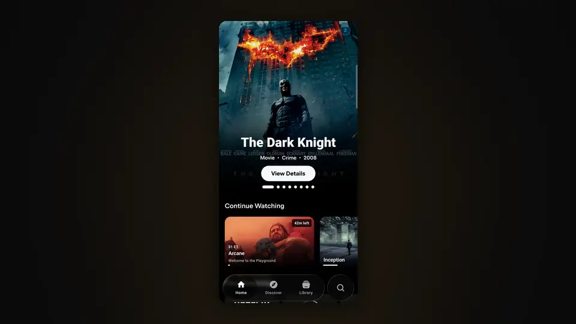

 

## Meet Viora

Viora is an Android app for discovering and watching movies and TV series.

It pairs a rich catalog built on TMDB, IMDb and Cinemeta data with **VIP Viora**, a playback engine that checks every source before showing it — and a source list that tells you exactly what you are about to watch: resolution, HDR, codecs, audio and subtitle languages, and size or bitrate when the source reports them.

Viora is being built as one entertainment app. Music is planned as its next part — see [Coming to Viora](#coming-to-viora).

 

## Features

### Home

Your catalogs as artwork-first rows, with **Continue Watching** and **Next Up** that pick up where you stopped — including the next episode of a series you are following.

  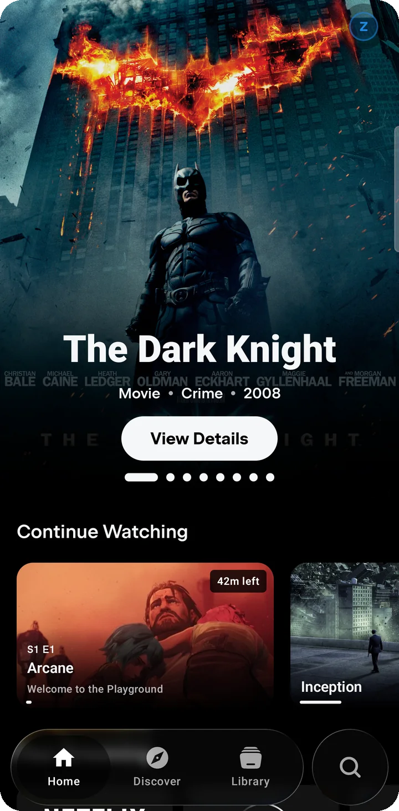
  &nbsp;
  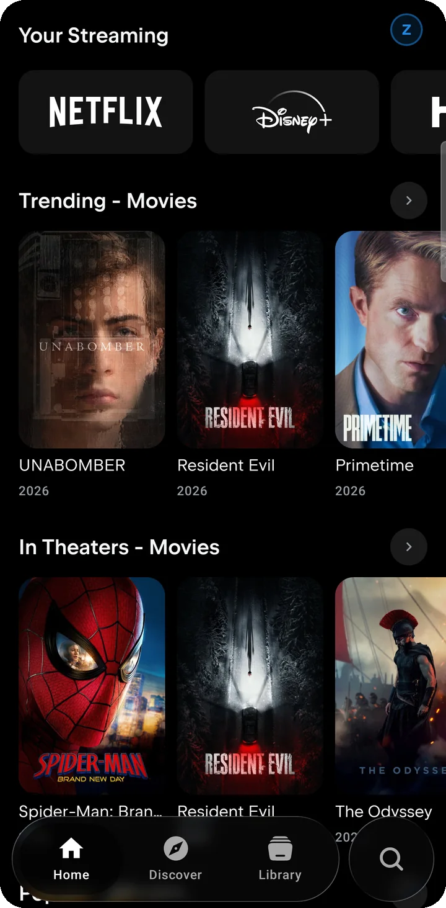

### Discover

A place to find something new. Featured picks learn from what you mark as *More like this* or *Not for me*; **Surprise me** picks a random title; a discovery queue, themed **Voyages**, genres and languages, award winners, critics' picks, collections and top studios fill the rest.

  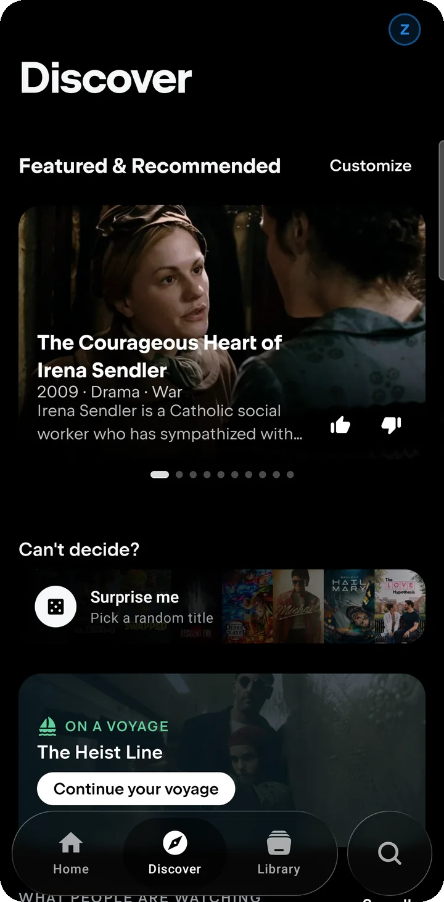
  &nbsp;
  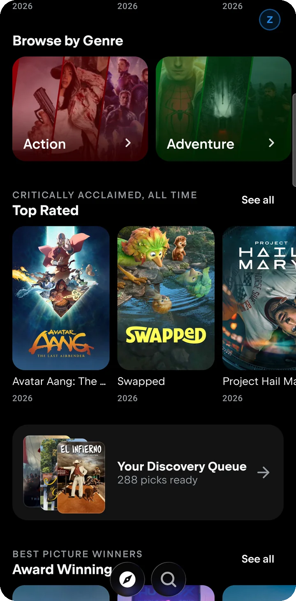

### Search

A dedicated search button sits beside the navigation dock. One query searches TMDB, IMDb and Cinemeta together, and before you type, Search opens on new releases to browse by type and genre.

  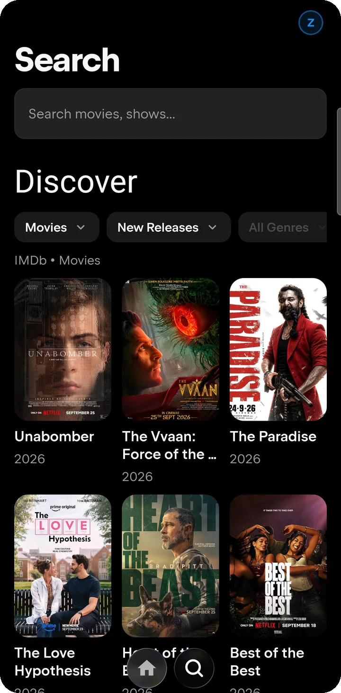

### Rich details

Every title gets a full page: artwork, synopsis, ratings, cast and crew, trailers, seasons and episodes, and pages for the people and studios behind it.

  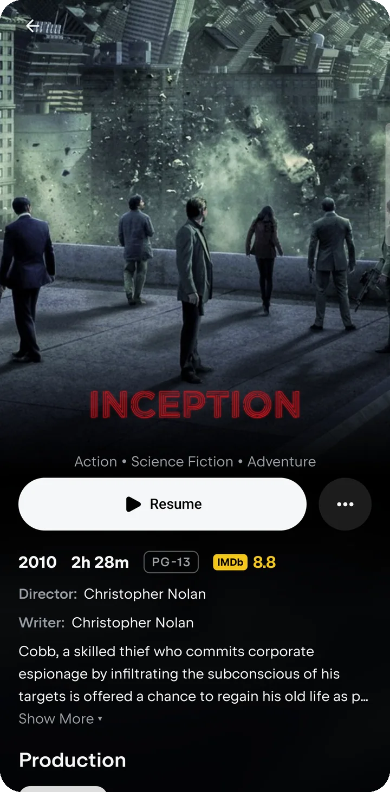
  &nbsp;
  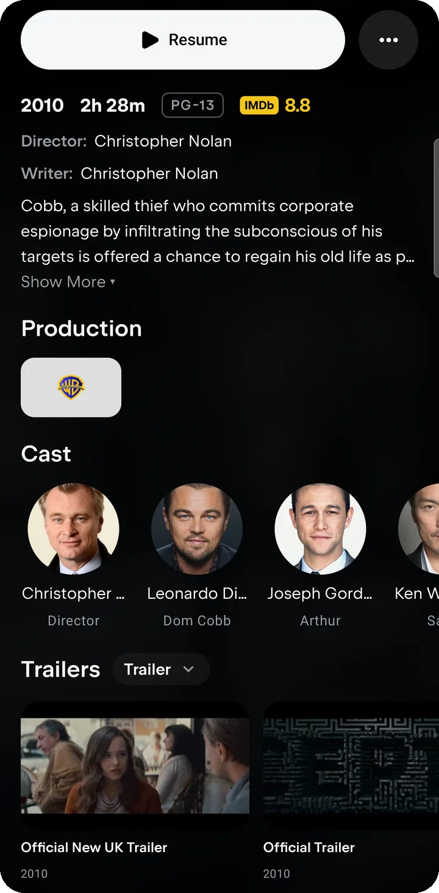
  &nbsp;
  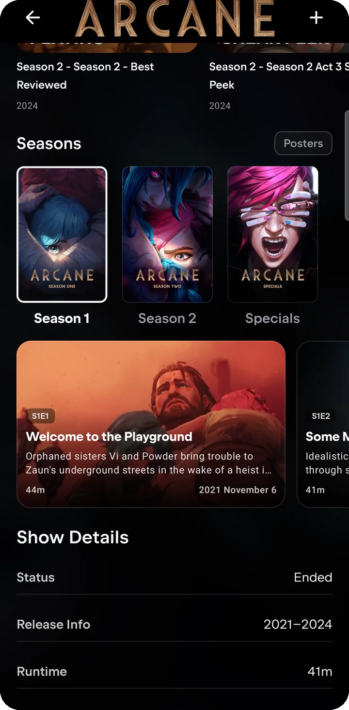

### VIP Viora — sources, checked before you see them

VIP Viora is Viora's own source engine. For each movie or episode it asks the provider integrations you have enabled, opens and checks every candidate stream, and lists only the ones that actually play.

- **Rich source cards** — resolution and HDR, the full release name, video and audio codecs, audio and subtitle languages, and size, bitrate and server whenever the source reports them. Unknown details are left out rather than guessed.
- **Auto** — picks the best source for *this* device and network: what the decoder, display and audio output support, the speed it measures, and how reliable each source has been.
- **Manual choice** — every checked source stays in the list, so you can pick one yourself at any time.
- **Source lock** — once a source starts playing or casting, Viora never switches to another one behind your back.

  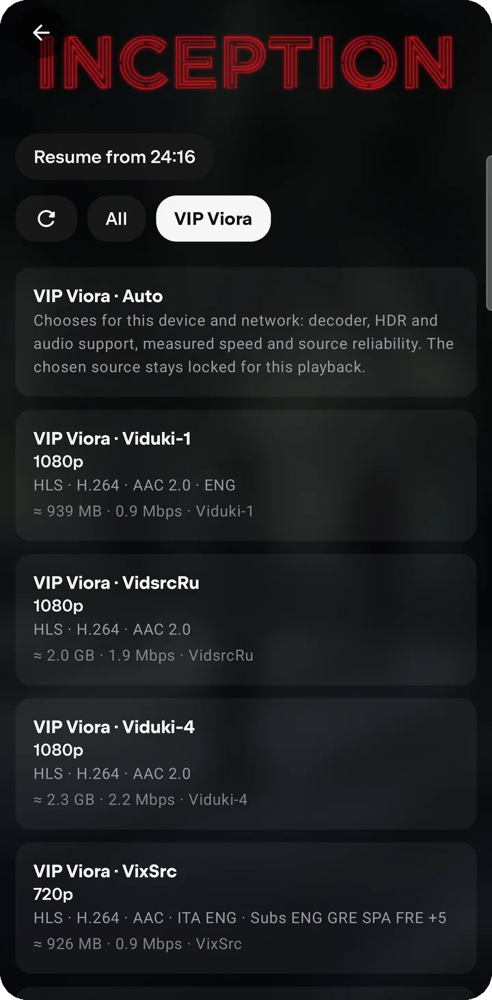
  &nbsp;
  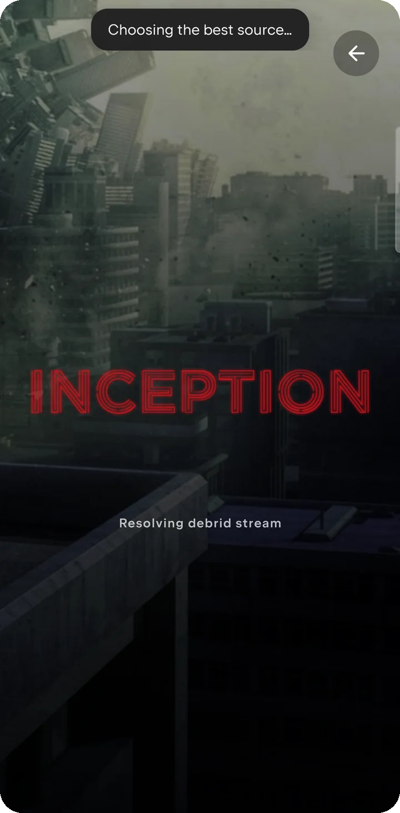

### Provider Health

A clear view of what works right now. Each server and extractor shows its status — working, unreachable from your network, blocked by the provider's protection, needing an app update, or turned off — together with the audio and subtitle languages it has been seen to offer. Every provider has its own **On/Off** switch, and one tap re-checks them all.

  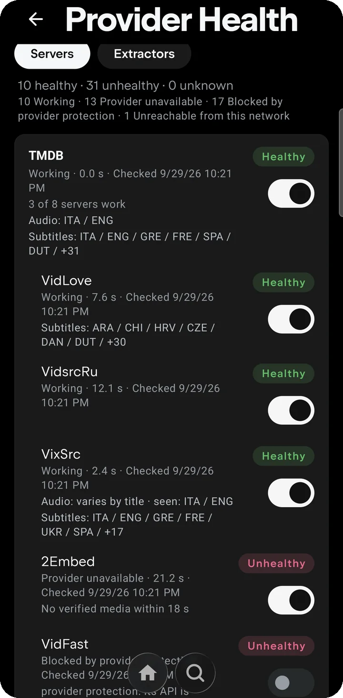
  &nbsp;
  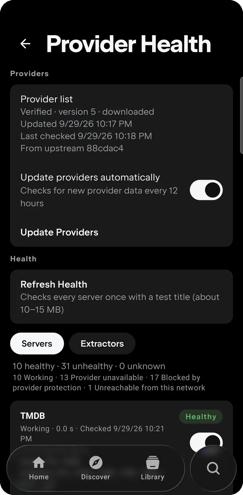

### Signed provider list

The provider list Viora uses is signed (Ed25519) and published in this repository. Viora checks for a newer one every 12 hours, or when you tap **Update Providers**, verifies the signature, and only then switches to it — in one step. A damaged or tampered list is rejected, and a failed update keeps the current list running. Provider fixes can therefore reach you without a new app version. [How updates work →](docs/UPDATES.md)

### Downloads & Library

Save titles to your Library and download movies and episodes to watch offline. Downloaded titles keep their details page, so you can browse what you saved without a connection.

  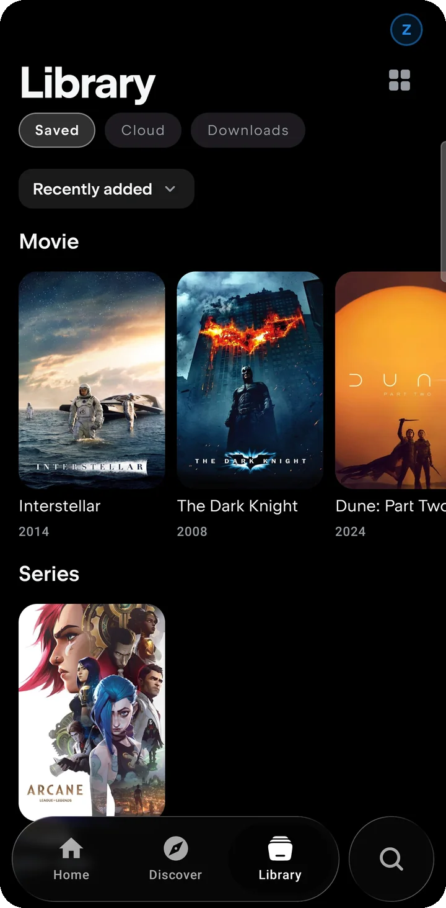
  &nbsp;
  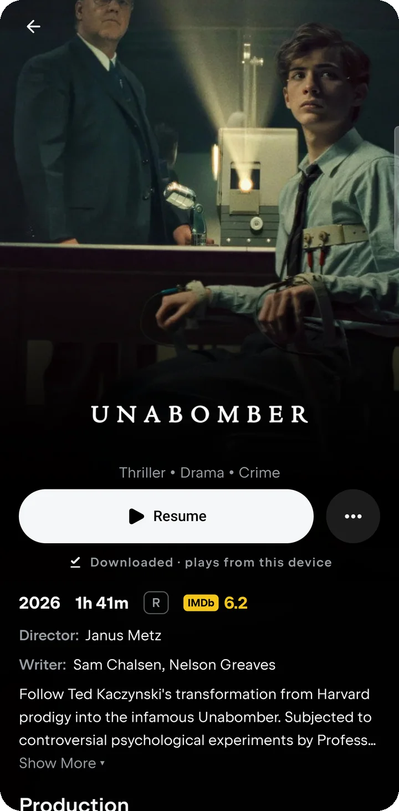

### Casting

Send playback to Chromecast devices and DLNA TVs on your network. When a source needs special request headers, your phone relays it to the TV, so it plays there just as it does on the phone.

### Player

A full-screen player with audio and subtitle track selection and a Sources panel, so you can see and change the stream you are watching from inside the player.

  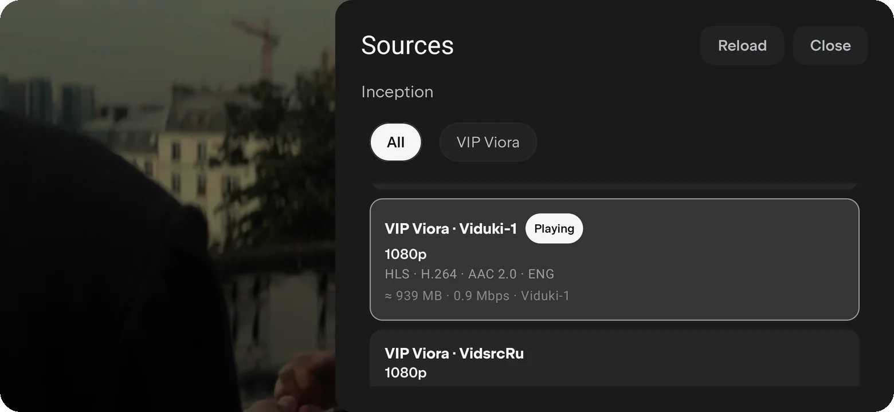

### Liquid glass interface

A floating glass dock for **Home**, **Discover** and **Library** with a separate search button. It adapts its size as you scroll — or stays expanded or compact — with an optional soft glow. Color themes such as Crimson, Ocean, Violet, Emerald, Amber and Rose, an AMOLED black mode and alternative app icons complete the look. The interface is available in more than 20 languages, including right-to-left Arabic and Hebrew.

  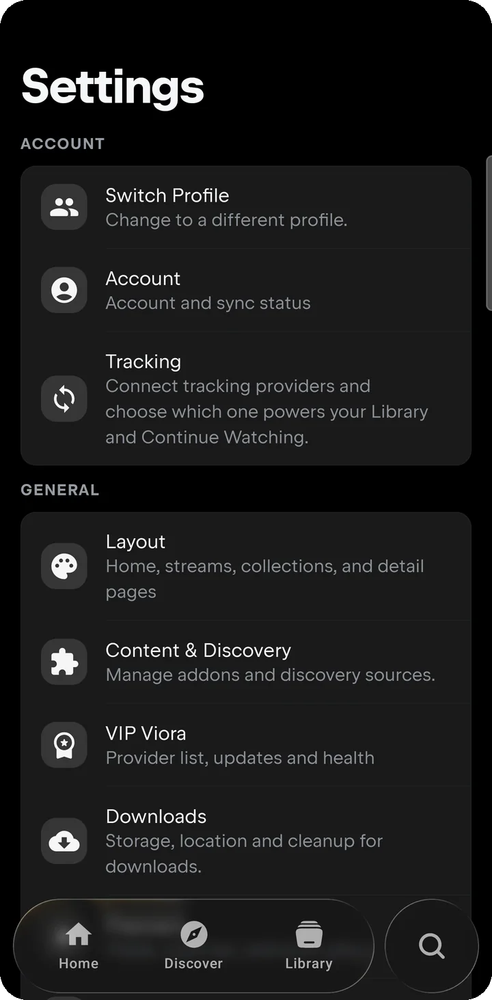
  &nbsp;
  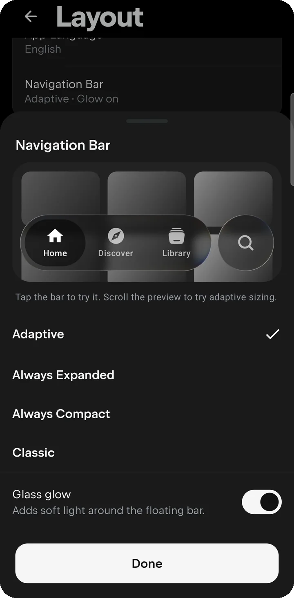

 

## Download Viora

<!-- viora:release:start -->
The first public release is being prepared. When it is published, this section lists its version, release date, SHA-256 checksum and a direct APK link, and the [Releases](https://github.com/zayo-0ni/viora/releases) page carries the APK together with its corresponding source code.
<!-- viora:release:end -->

| | |
| --- | --- |
| **Requires** | Android 7.0 (API 24) or newer |
| **Where** | [GitHub Releases](https://github.com/zayo-0ni/viora/releases/latest) — the only official download location |
| **Verify** | Compare the APK's SHA-256 with the checksum published next to it |

<b>Installing an APK on Android</b>

 

1. Download the APK on your phone from the [latest release](https://github.com/zayo-0ni/viora/releases/latest).
2. Open it. If Android asks, allow your browser or file manager to install unknown apps.
3. To update later, install the newer APK over the existing app — your library and settings stay.

 

## Updates

- **Provider updates** arrive on their own: Viora downloads the signed provider list, verifies it and activates it without a new app version.
- **App releases** are published on [Releases](https://github.com/zayo-0ni/viora/releases), each described in `updates/latest.json` (version, date, APK link and checksum). Viora reads this file to offer new releases in **Settings → App updates**, and installs one only after verifying its checksum and signing key.

Details: [docs/UPDATES.md](docs/UPDATES.md)

 

## Privacy

Viora has no Viora account, no analytics and no advertising SDKs. Your library, watch progress, downloads and settings stay on your device. Viora contacts the metadata services and providers needed to show and play what you choose. The full statement: [PRIVACY.md](PRIVACY.md)

 

## Coming to Viora

These are planned and **not part of the current release**:

- **Music** — a unified Music section based on BitChord, in the same app
- **Google sign-in** and a Viora account
- **Sync** for playlists, the library and settings across devices
- **In-app app updates** from the published update manifest
- Further **Discover** improvements

 

## Support

- **Bug reports** — [open an issue](https://github.com/zayo-0ni/viora/issues/new/choose) using the bug report form
- **Feature requests** — [suggest an idea](https://github.com/zayo-0ni/viora/issues/new/choose)
- **Release notes** — [Releases](https://github.com/zayo-0ni/viora/releases) and [CHANGELOG.md](CHANGELOG.md)

Please never post passwords, account details, tokens or other private information in an issue.

 

## Open source

Viora is free software under the [GNU General Public License v3.0](LICENSE). It is a modified version of [Nuvio Mobile](https://github.com/NuvioMedia/NuvioMobile), also GPL-3.0, and includes work from other open-source projects, each credited with its notice.

- **License** — [LICENSE](LICENSE)
- **Corresponding source** — every release includes `Viora-<version>-source.zip`, the complete source code of that exact APK. [About the source →](docs/SOURCE.md)
- **Third-party notices** — [THIRD_PARTY_NOTICES.md](THIRD_PARTY_NOTICES.md)

 

## Content & responsibility

Viora does not host, store or distribute any media. It shows metadata from TMDB, IMDb and Cinemeta and connects to third-party services that you enable and control. What is available depends entirely on those services. Please respect the laws of your country and the rights of content owners.

This product uses the TMDB API but is not endorsed or certified by TMDB.

 

  
   
  Viora · Android

