

  <a href="README.md">English</a> &nbsp;·&nbsp; <b>العربية</b>

  

<h3 align="center" dir="rtl">أفلامٌ ومسلسلات بعرضٍ يليق بها، تُشغَّل من مصادر تتحكّم بها أنت.</h3>

  
  
  
  

  

  <a href="#meet-viora">نظرة عامة</a> &nbsp;·&nbsp;
  <a href="#features">الميزات</a> &nbsp;·&nbsp;
  <a href="#vip-viora">VIP Viora</a> &nbsp;·&nbsp;
  <a href="#download-viora">التنزيل</a> &nbsp;·&nbsp;
  <a href="#updates">التحديثات</a> &nbsp;·&nbsp;
  <a href="#privacy">الخصوصية</a> &nbsp;·&nbsp;
  <a href="#open-source">المصدر المفتوح</a>

 

  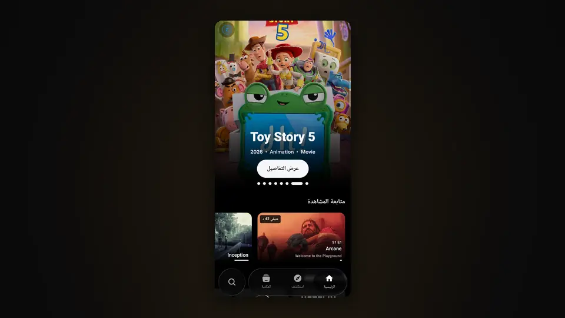

 

## تعرّف على Viora

Viora تطبيق أندرويد لاكتشاف الأفلام والمسلسلات ومشاهدتها.

يجمع كتالوجًا غنيًّا مبنيًّا على بيانات TMDB وIMDb وCinemeta مع **VIP Viora**، وهو محرّك تشغيل يفحص كل مصدر قبل أن يعرضه عليك. وتخبرك قائمة المصادر بدقّة بما ستشاهده: الدقّة وHDR والترميز ولغات الصوت والترجمة، والحجم أو معدّل البت متى ذكرهما المصدر.

يُبنى Viora ليكون تطبيقًا واحدًا للترفيه، والموسيقى مخطَّط لها لتكون جزأه التالي. راجع [قادم إلى Viora](#coming-to-viora).

 

## الميزات

### الرئيسية

كتالوجاتك في صفوف تتصدّرها الصور، مع **متابعة المشاهدة** و**التالي** اللذين يستأنفان من حيث توقّفت، حتى الحلقة التالية من المسلسل الذي تتابعه.

  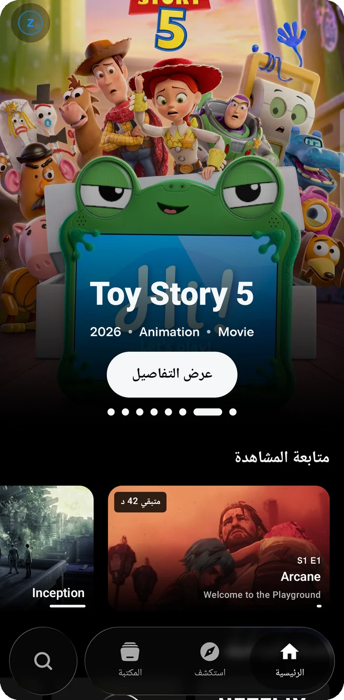
  &nbsp;
  

### استكشف

مكان تجد فيه ما هو جديد عليك. تتعلّم الاقتراحات المميّزة ممّا تختاره بـ*المزيد مثل هذا* أو *ليس لي*، ويختار لك زرّ **فاجئني** عملًا عشوائيًّا، وتكمل الصورةَ قائمةُ اكتشاف و**رحلات** موضوعية وتصفّح حسب التصنيف واللغة وأعمال فائزة بالجوائز واختيارات النقّاد والمجموعات وأبرز الاستوديوهات.

  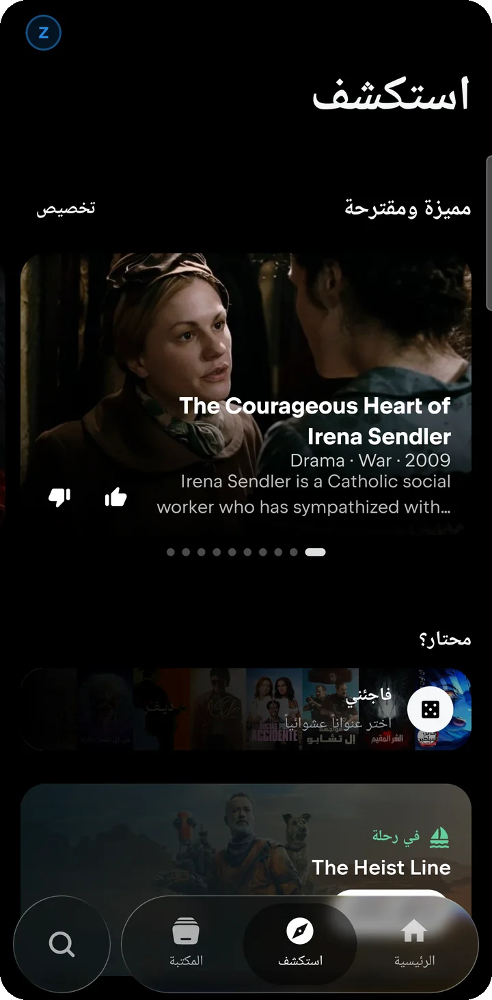
  &nbsp;
  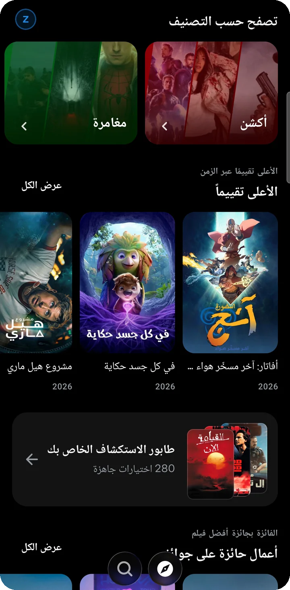

### البحث

زرّ بحث مستقل بجانب شريط التنقّل، وبحث واحد يشمل TMDB وIMDb وCinemeta معًا. وقبل أن تكتب، تفتح صفحة البحث على أحدث الإصدارات لتتصفّحها حسب النوع والتصنيف.

  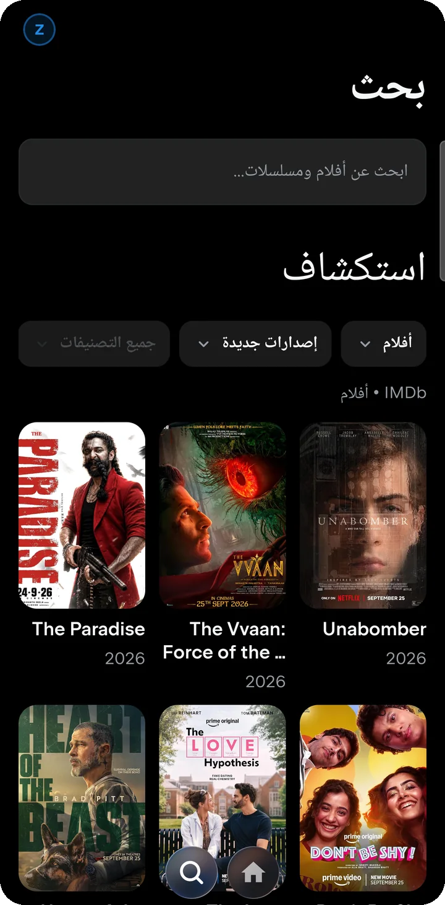

### صفحات تفاصيل غنية

لكل عمل صفحة كاملة: الصور والملخّص والتقييمات وطاقم التمثيل والعمل والإعلانات التشويقية والمواسم والحلقات، وصفحات للأشخاص والاستوديوهات الذين يقفون خلفه.

  
  &nbsp;
  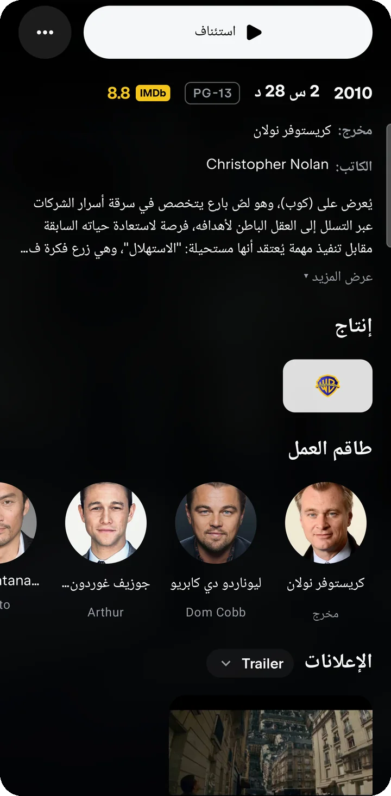
  &nbsp;
  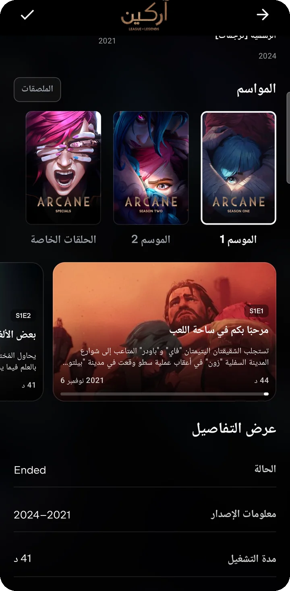

### VIP Viora: مصادر مفحوصة قبل أن تراها

VIP Viora محرّك المصادر الخاص بـViora. لكل فيلم أو حلقة يسأل تكاملات المزوّدين التي فعّلتها، ويفتح كل بثّ مرشّح ويفحصه، ولا يعرض إلا ما يعمل فعلًا.

- **بطاقات مصادر غنية**: الدقّة وHDR، واسم الإصدار كاملًا، وترميز الصورة والصوت، ولغات الصوت والترجمة، والحجم ومعدّل البت والخادم متى ذكرها المصدر. وما لا يُعرف يُترك ولا يُخمَّن.
- **الاختيار التلقائي**: يختار أفضل مصدر لـ*هذا* الجهاز وهذه الشبكة، بحسب ما يدعمه فكّ الترميز والشاشة ومخرج الصوت، والسرعة التي يقيسها، وموثوقية كل مصدر فيما سبق.
- **الاختيار اليدوي**: تبقى المصادر المفحوصة كلها في القائمة لتختار منها بنفسك متى شئت.
- **تثبيت المصدر**: ما إن يبدأ مصدر بالتشغيل أو البثّ إلى التلفاز، لا يبدّله Viora بغيره من دون علمك.

  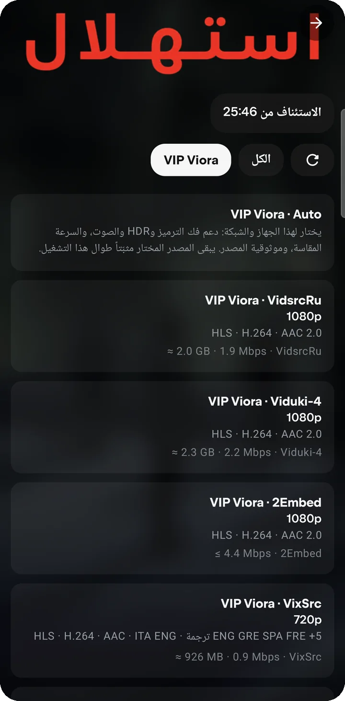
  &nbsp;
  

### صحة المزوّدين

صورة واضحة لما يعمل الآن. لكل خادم ومستخرِج حالته: يعمل، أو غير قابل للوصول من شبكتك، أو محجوب بحماية المزوّد، أو يحتاج تحديثًا للتطبيق، أو متوقف، ومعها لغات الصوت والترجمة التي رُصدت لديه. ولكل مزوّد مفتاح **تشغيل/إيقاف** خاص به، ونقرة واحدة تعيد فحصها جميعًا.

  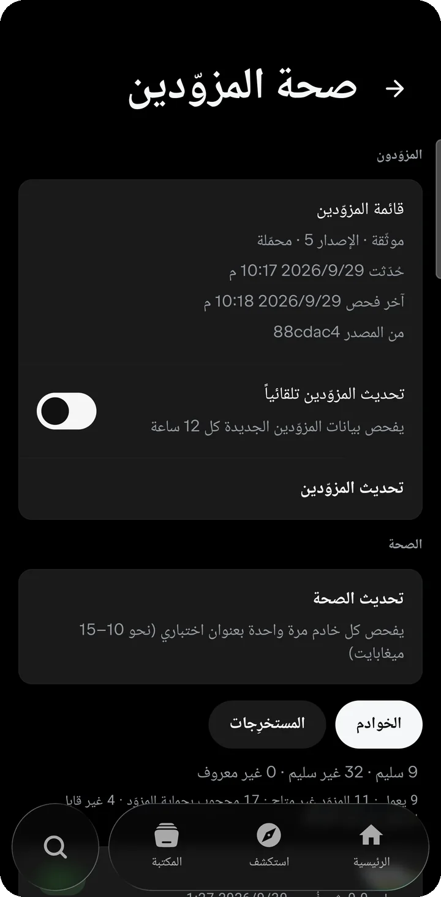
  &nbsp;
  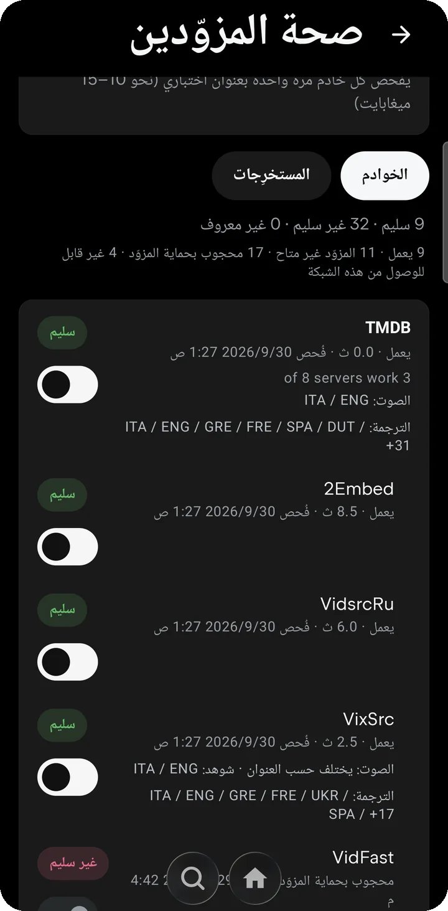

### قائمة مزوّدين موقّعة

قائمة المزوّدين التي يعتمدها Viora موقّعة رقميًّا (Ed25519) ومنشورة في هذا المستودع. يبحث Viora عن نسخة أحدث كل 12 ساعة، أو حين تنقر **تحديث المزوّدين**، فيتحقّق من التوقيع ثم ينتقل إليها دفعة واحدة. تُرفض القائمة التالفة أو المعدَّلة، ويبقى التطبيق على قائمته الحالية إذا فشل التحديث. وهكذا تصلك إصلاحات المزوّدين من دون إصدار جديد للتطبيق. [كيف تعمل التحديثات ←](docs/UPDATES_AR.md)

### التنزيلات والمكتبة

احفظ الأعمال في مكتبتك، ونزّل الأفلام والحلقات لتشاهدها دون اتصال. وتحتفظ الأعمال المنزَّلة بصفحة تفاصيلها، فتتصفّح ما حفظته بلا إنترنت.

  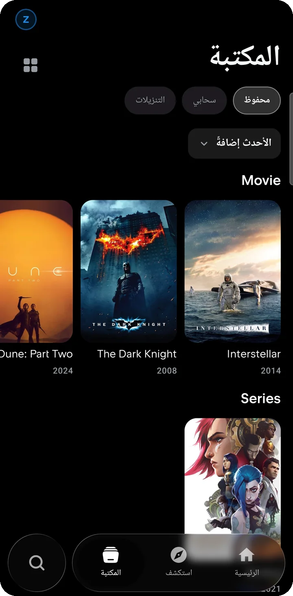
  &nbsp;
  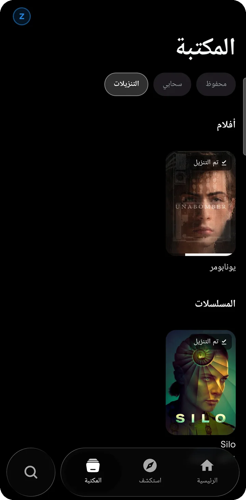

### البثّ إلى التلفاز

أرسل التشغيل إلى أجهزة Chromecast وأجهزة التلفاز التي تدعم DLNA على شبكتك. وإذا احتاج المصدر ترويسات طلب خاصة، يمرّره هاتفك إلى التلفاز ليعمل هناك كما يعمل على الهاتف.

### المشغّل

مشغّل بملء الشاشة مع اختيار مسارات الصوت والترجمة ولوحة للمصادر، لترى البثّ الذي تشاهده وتغيّره من داخل المشغّل.

  

### واجهة زجاجية سائلة

شريط تنقّل زجاجي عائم يضمّ **الرئيسية** و**استكشف** و**المكتبة** مع زرّ بحث مستقل، يتكيّف حجمه مع التمرير أو يبقى موسّعًا أو مضغوطًا، مع توهّج ناعم اختياري. وتكمل المظهرَ سماتُ ألوان مثل القرمزي والمحيطي والبنفسجي والزمرّدي والكهرماني والوردي، ووضع أسود AMOLED، وأيقونات بديلة للتطبيق. والواجهة متاحة بأكثر من 20 لغة، منها العربية والعبرية باتجاه من اليمين إلى اليسار.

  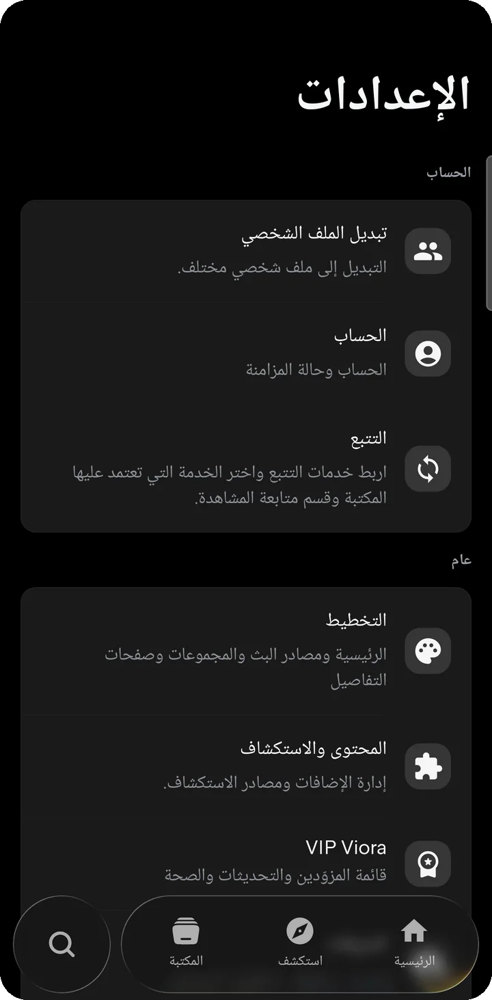
  &nbsp;
  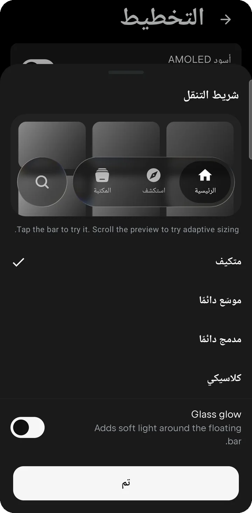

 

## حمّل Viora

<!-- viora:release-ar:start -->
| | |
| --- | --- |
| **أحدث إصدار** | **1.1.1** (البناء 138) · صدر في 2026-10-05 |
| **التنزيل** | [**Viora-1.1.1.apk**](https://github.com/zayo-0ni/viora/releases/download/v1.1.1/Viora-1.1.1.apk) · 168 MB · يعمل على كل الأجهزة المدعومة |
| **تنزيلات أصغر** | [arm64-v8a](https://github.com/zayo-0ni/viora/releases/download/v1.1.1/Viora-1.1.1-arm64-v8a.apk) (لمعظم الهواتف) · [armeabi-v7a](https://github.com/zayo-0ni/viora/releases/download/v1.1.1/Viora-1.1.1-armeabi-v7a.apk) (للهواتف الأقدم بنظام 32 بت) |
| **SHA-256** | `b4779717be459567db7f13f92fc2becc5cbc81008dbeb4fd9f142a3e25be067f` |
| **الشيفرة المصدرية** | [Viora-1.1.1-source.zip](https://github.com/zayo-0ni/viora/releases/download/v1.1.1/Viora-1.1.1-source.zip) |
| **ملاحظات الإصدار** | [Viora 1.1.1](https://github.com/zayo-0ni/viora/releases/tag/v1.1.1) |
<!-- viora:release-ar:end -->

| | |
| --- | --- |
| **المتطلبات** | أندرويد 7.0 (API 24) أو أحدث |
| **المصدر** | [إصدارات GitHub](https://github.com/zayo-0ni/viora/releases/latest)، وهي مكان التنزيل الرسمي الوحيد |
| **التحقّق** | طابِق بصمة SHA-256 لملف APK مع البصمة المنشورة بجانبه |

<b>تثبيت ملف APK على أندرويد</b>

 

1. نزّل ملف APK على هاتفك من [أحدث إصدار](https://github.com/zayo-0ni/viora/releases/latest).
2. افتحه، وإذا طلب أندرويد ذلك فاسمح لمتصفّحك أو مدير الملفات بتثبيت التطبيقات غير المعروفة.
3. للتحديث لاحقًا ثبّت ملف APK الأحدث فوق التطبيق الحالي، وستبقى مكتبتك وإعداداتك كما هي.

 

## التحديثات

- **تحديثات المزوّدين** تصل وحدها: ينزّل Viora قائمة المزوّدين الموقّعة ويتحقّق منها ثم يفعّلها دون إصدار جديد للتطبيق.
- **إصدارات التطبيق** تُنشر في [الإصدارات](https://github.com/zayo-0ni/viora/releases)، ويصف كلًّا منها الملف `updates/latest.json` (رقم الإصدار وتاريخه ورابط APK وبصمته). ويقرأ Viora هذا الملف ليعرض الإصدارات الجديدة في **الإعدادات ← تحديثات التطبيق**، ولا يثبّت أيًّا منها إلا بعد التحقق من بصمته ومفتاح توقيعه.

التفاصيل: [docs/UPDATES_AR.md](docs/UPDATES_AR.md)

 

## الخصوصية

حساب Viora اختياري: تسجيل الدخول بحساب Google يزامن إعداداتك بين أجهزتك ويفتح VIP Viora للمشتركين. لا يحتوي Viora على أدوات تحليلات ولا حِزم إعلانات. تبقى مكتبتك وتقدّم مشاهدتك وتنزيلاتك على جهازك، ولا يتّصل Viora إلا بخدمات البيانات والمزوّدين اللازمة لعرض ما تختاره وتشغيله. البيان الكامل: [PRIVACY_AR.md](PRIVACY_AR.md)

 

## قادم إلى Viora

ما يلي مخطَّط له، و**ليس جزءًا من الإصدار الحالي**:

- **الموسيقى**: قسم موسيقى موحّد مبنيّ على BitChord داخل التطبيق نفسه
- **المزامنة** لقوائم التشغيل والمكتبة بين الأجهزة (الإعدادات تُزامَن الآن مع حساب Viora)
- مزيد من التحسينات على **استكشف**

 

## الدعم

- **الإبلاغ عن مشكلة**: [افتح بلاغًا](https://github.com/zayo-0ni/viora/issues/new/choose) عبر نموذج الإبلاغ عن الأخطاء
- **اقتراح ميزة**: [شاركنا فكرتك](https://github.com/zayo-0ni/viora/issues/new/choose)
- **ملاحظات الإصدارات**: [الإصدارات](https://github.com/zayo-0ni/viora/releases) و[CHANGELOG.md](CHANGELOG.md)

لا تنشر في أي بلاغ كلمات مرور أو بيانات حسابات أو رموز وصول أو أي معلومات خاصة.

 

## المصدر المفتوح

Viora برنامج حرّ مرخَّص بموجب [رخصة جنو العمومية العامة، الإصدار 3](LICENSE). وهو نسخة معدَّلة من [Nuvio Mobile](https://github.com/NuvioMedia/NuvioMobile) المرخَّص بـGPL-3.0 أيضًا، ويتضمّن أعمالًا من مشاريع مفتوحة المصدر أخرى، لكلٍّ منها إشعاره.

- **الترخيص**: [LICENSE](LICENSE)
- **الشيفرة المصدرية المقابلة**: يضمّ كل إصدار الملف `Viora-<version>-source.zip`، وهو الشيفرة المصدرية الكاملة لملف APK ذاك بعينه. [عن الشيفرة المصدرية ←](docs/SOURCE_AR.md)
- **إشعارات الأطراف الثالثة**: [THIRD_PARTY_NOTICES.md](THIRD_PARTY_NOTICES.md)

 

## المحتوى والمسؤولية

لا يستضيف Viora أي وسائط ولا يخزّنها ولا يوزّعها. يعرض بيانات من TMDB وIMDb وCinemeta، ويتّصل بخدمات أطراف ثالثة تفعّلها أنت وتتحكّم بها، وما يتوفّر من محتوى يعود كليًّا إلى تلك الخدمات. نرجو احترام قوانين بلدك وحقوق أصحاب المحتوى.

يستخدم هذا المنتج واجهة TMDB البرمجية، لكنه غير معتمَد أو موثَّق من TMDB.

 

  
   
  Viora · Android

